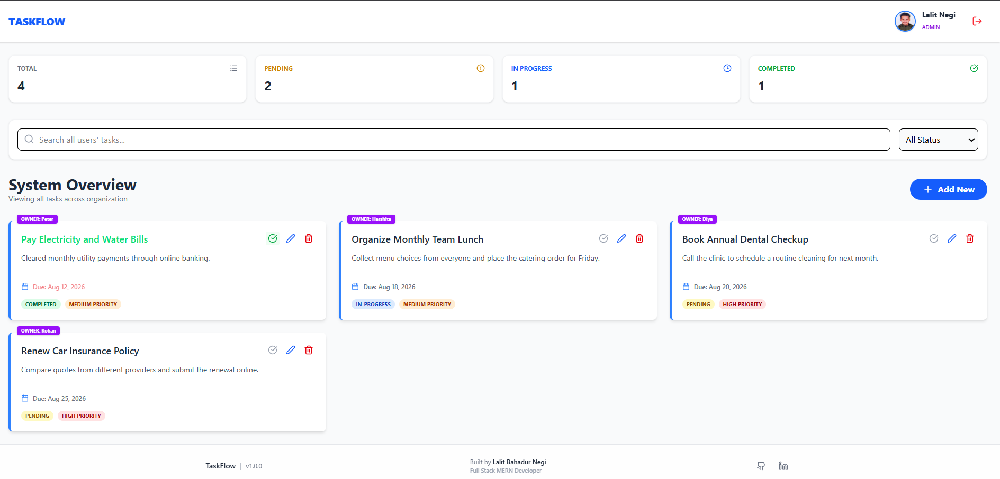
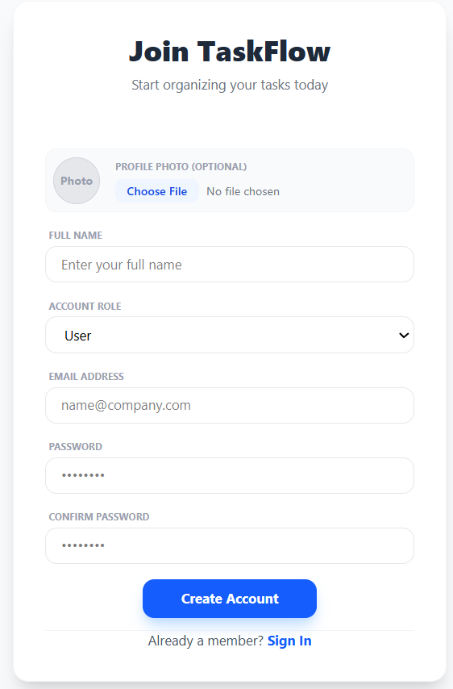
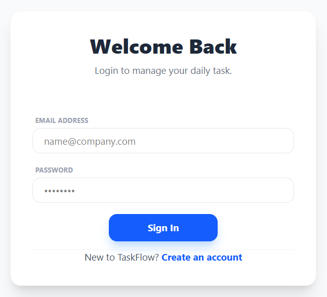
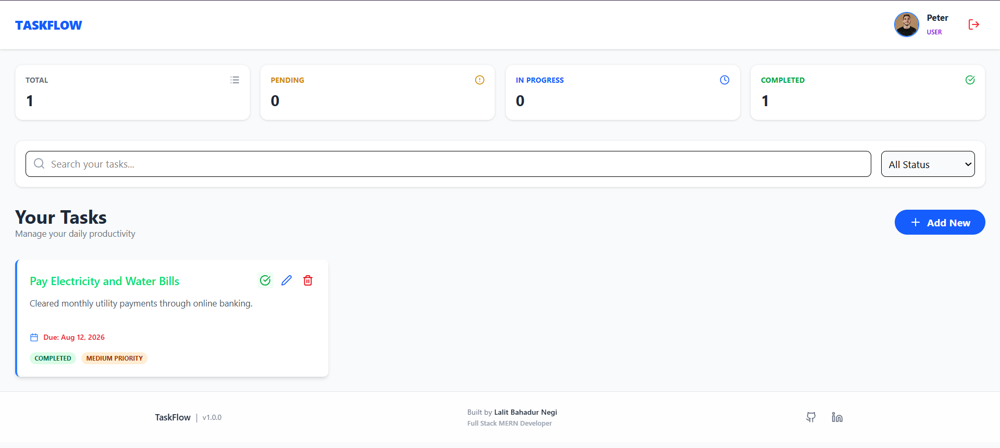
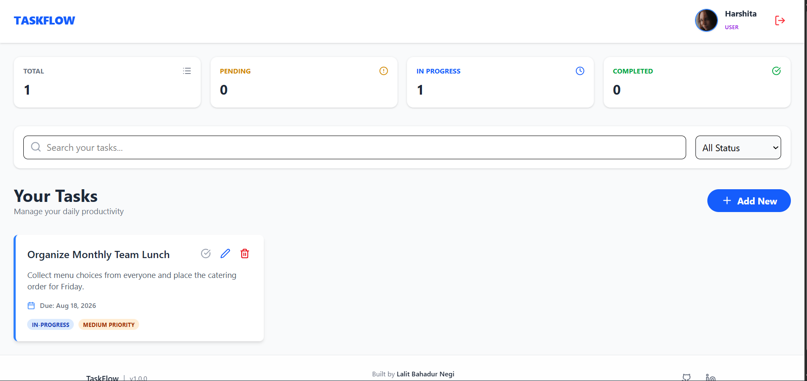
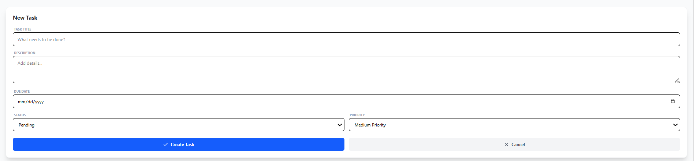
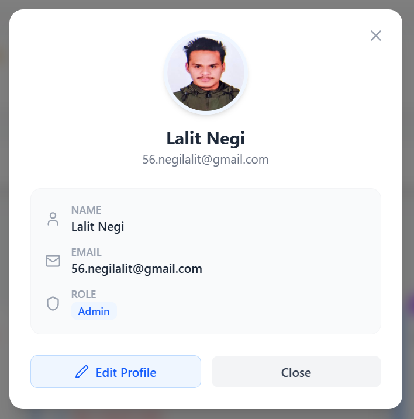

# Taskflow - Full-Stack Task Management System

A modern, full-stack task management application built with react, Node.js, Express, and MongoDB. Organize, track, and prioritize your daily tasks with real-time status updates and dynamic urgency alerts.

<!-- HERO PREVIEW SCREENSHOT -->
<p align="center">
  
</p>

---

## 🖼️ System Preview

<div align="center">
  <table border="0">
    <tr>
      <td width="100%" align="center">
        <b>Dashboard </b><br/><br/>
        
      </td>
    </tr>
    <tr>
    <td width="50%" align="center">
        <b>Sign UP</b><br/><br/>
        
      </td>
      <td width="50%" align="center">
        <b>Sign In</b><br/><br/>
        
      </td>
    </tr>
    <tr>
      <td width="50%" align="center">
        <b>User 1</b><br/><br/>
        
      </td>
      <td width="50%" align="center">
        <b>User 2</b><br/><br/>
        
      </td>
    </tr>
      <td width="50%" align="center">
        <b>User 1</b><br/><br/>
        
      </td>
      <td width="50%" align="center">
        <b>User 2</b><br/><br/>
        
      </td>
    </tr>
      <td width="50%" align="center">
        <b>Add New Task</b><br/><br/>
        
      </td>
      <td width="50%" align="center">
        <b>Profile</b><br/><br/>
        
      </td>
    </tr>
  </table>
</div>
---

## 🚀 Features

- **Task Management**: Create, update, delete, and toggle completion states for tasks effortlessly.
- **Smart Urgency Indicator**: Color-coded badges and animations alert you when tasks are approaching their due date or overdue:
  - **🔴 Overdue**: Pulsing red alert
  - **🟠 Due < 24 hrs**: High-priority orange warning
  - **🔵 Due < 3 days**: Blue notice

- **Search & Dynamic Filtering**: Filter tasks instantly by status (Pending, In Progress, Completed) or search by title.
- **Responsive Dashboard**: Mobile-first design with responsive multi-column layouts for mobile, tablet, and desktop viewports.
- **Visual Task Metrics**: Quick stats bar displaying total, completed, pending, and in-progress task counts.

## 🛠️ Tech Stack

- **Frontend**:
  - React(Vite/CRA)
  - Tailwind CSS(Styling & Responsive Layouts)
  - Lucide React (UI Icons)

- **Backend**:
  - Node.js & Express.js(Database)
  - MongoDB with Mongoose(Database)

## ⚡ Getting Started

### Prerequisites

Make sure you have the following installed on your machine: - Node.js (v16.x or higher) - npm or yarn - MongoDB (Local instance or MongoDB Atlas cluster)

#### 1. Clone the Repository

```bash
git clone git@github.com:lalit058/Taskflow.git
cd taskflow
```

### 2. Configure Environment Variables

set up DB connection and server port

create a .env file inside the server/directory:

```bash
PORT=5000
MONGO_URI=mongodb://localhost:27017/taskflow
NODE_ENV=development
```

### 3. Install Dependencies

Run for both client and server

```bash
# Install server dependencies
cd backend
npm install

# Install client dependencies
cd frontend
npm install
```

### 4. Run the Application

```bash
# Start the backend server:
cd Backend
node server.js

# start the frontend in a seperate terminal
cd Frontend
npm run dev

Open your browser and navigate to http://localhost:5173 (or http://localhost:3000).
```

## 📡 API Endpoints

| Method   | Endpoint                | Description                                |
| :------- | :---------------------- | :----------------------------------------- |
| `GET`    | `/api/tasks`            | Fetch all tasks (supports query filtering) |
| `POST`   | `/api/tasks`            | Create a new task                          |
| `PUT`    | `/api/tasks/:id`        | Update an existing task                    |
| `PATCH`  | `/api/tasks/:id/status` | Toggle task status (Completed/Pending)     |
| `DELETE` | `/api/tasks/:id`        | Delete a task                              |

## 🤝 Contributing

Contributions are welcome! Follow these steps to contribute to the project:

1. **Fork the Repository**
   Click the **Fork** button at the top right of this repository to create your own copy.

2. **Create a Feature Branch**

```bash
git checkout -b branch-name
```

3. **Commit your changes**

```bash
git commit -m "message or commit message"
```

4. **Push to the Branch**

```bash
git push origin branch-name
```

5. **Open a Pull Request**
   Go to the original repository on GitHub and click **Compare & pull request** to submit your changes for review.
